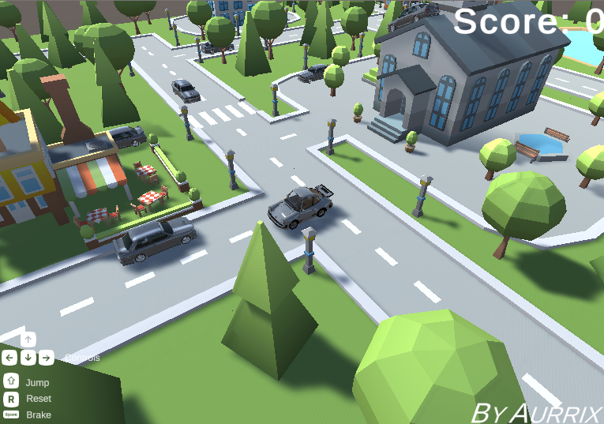

# Porsche Crash Game

Welcome to the Porsche Crash Game repository! This game allows you to control a retro Porsche as it crashes into retro BMWs to gain scores. Use your arrow keys for control, spacebar to brake, shift key to jump, and 'R' to reset your position.

## How to Play
1. **Controls:**
    - Use the **arrow keys** to move the Porsche.
    - Press **Spacebar** to apply brakes.
    - Press **Shift** to make the Porsche jump.
    - Press **R** to reset the position of the Porsche.

2. **Scoring:**
    - Gain scores by crashing into retro BMWs.

3. **Objective:**
    - The objective is to score as high as possible by crashing into BMWs while avoiding obstacles.

## Accessing the Game
You can access the game through the following URL: [Porsche Crash Game](https://aurrix.github.io/porsche-game/dist/)

## Contributions
Contributions to the game are welcome! If you find any issues or have suggestions for improvements, feel free to open an issue or create a pull request.

## Credits
This game is developed by [aurrix](https://github.com/aurrix).

Thank you for playing! Enjoy crashing into retro BMWs with your retro Porsche! 🚗💥🏎️